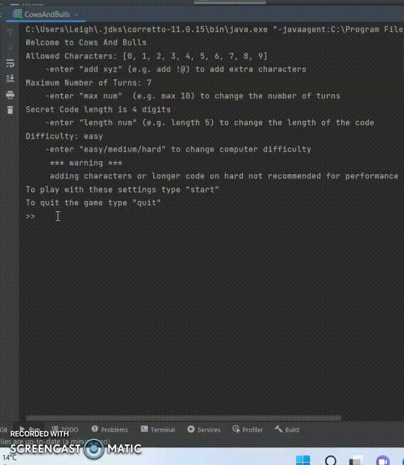
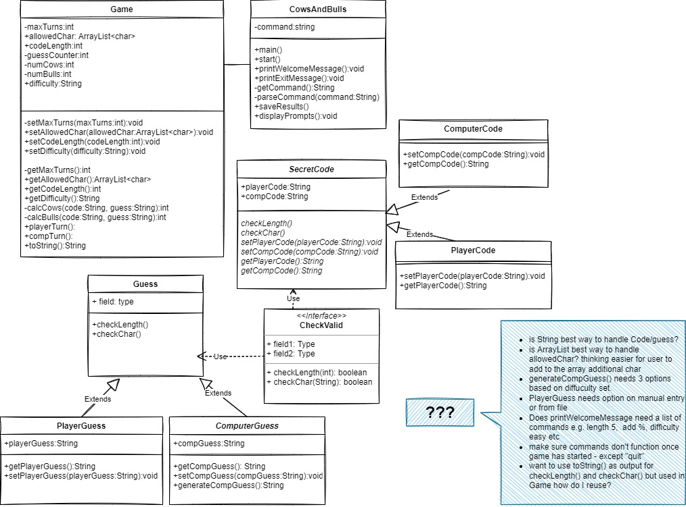
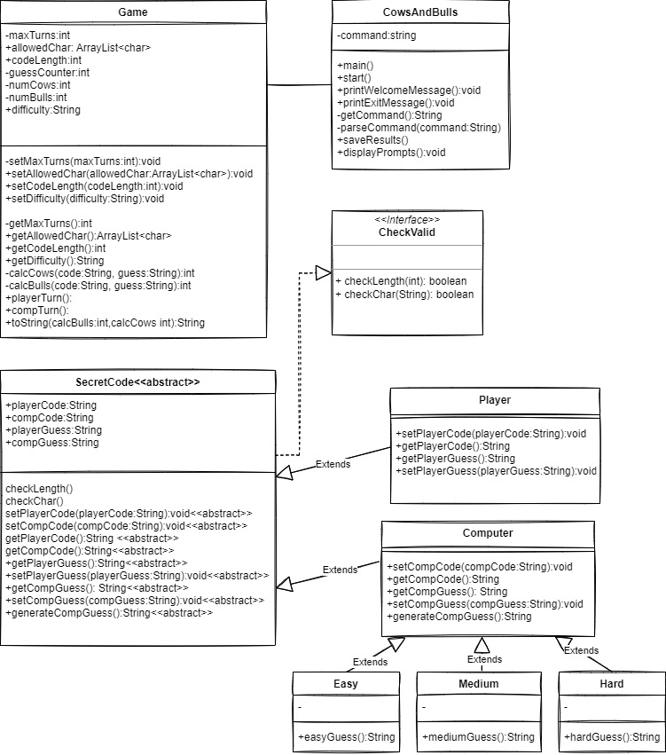

# Cows-and-Bulls-Game-Reflection

## Overview
As this was for a university assignment I feel it isn't appropriate to have to code in a public repository for academic integrity reasons.
The following is my reflection and evaluation.

The bulls and cows game is a code-breaking game designed for two or more players. Each player chooses a secret code of 4 digits from 0 – 9. The digits must be all different. The goal of the game is for each player to guess the other player's secret code.

The players in turn present their guesses to the opponents. The opponents respond by telling the players:
1. The number of bulls, i.e. the number of matching digits in their right positions, and
2. The number of cows, i.e. the number of matching digits but in different positions.

### Requirements
The main goal of this assignment is to develop the bulls and cows game that allows a single player to play interactively against the computer. 
- The game stores two secret codes, one from the player and one from the computer. 
- The player and the computer will try to guess each other’s secret code. 
- Both the player and the computer only have seven attempts for guessing the secret code. 
- If the player enters an invalid input, the game should ask the player to try again. 
- The game also lets the player choose the difficulty level to play against the computer. 
- There are three levels: easy, medium and hard. 
- The game can read from a text file that contains multiple guesses from the player, and save the results to another text file.

## Initial Design

In the initial design, there were incorrect arrows for the interface. I need to be careful when using an unfamiliar drawing package. 

Originally, I had SecretCode and Guesses as separate classes and subclass, my feedback was that they would have similar methods and to merge them into one to avoid unnecessary duplication. Also, split up the computer class into three subclasses for the difficulty levels to minimise the need for if-else statements.

## Changes to the Initial Design
### Game Class

I did not end up using toString() method. There were many different String outputs required and I found toString() became redundant very quickly. I may need to practice toString() usage as I think there may have been ways I could have utilised it to help reduce repetition of output text.

Using public assessor methods allowed me to make all the variables in the game class private. Also I changed the method names slightly to clarify purpose.

I kept the computeCows and computeBulls methods private as it determines the game result however this did mean I had to duplicate the code in the hard subclass as it was essentially the same code to narrow down computer possible guesses.

A create character list method was used rather than a static list of characters. This allows users to add characters from the 
user interface rather than having to alter the code directly.

saveFile method was added here as it seemed to work better with the flow of the game. I added printResults method as a way of decreasing the code repetition that was occurring for the printing to file and console for both the computer and 
player rounds. Also, if formatting and content changes is needed in the future, code would only need to be changed in 
one location.

### CowsAndBulls Class
This is the class from where the game is executed. The only change from initial design was to move the saveFile 
method from here and place in Game.

### CheckValid Class
This was an interface I initially designed with the thought the checks to make sure guesses and codes were valid would 
need to occur in various classes. But as I developed the methods to generate computer codes and guesses I did them 
with the valid parameters in place, so these checks were now only needed for player inputs. This made the need for this 
interface unnecessary.

### SecretCode Class
As I developed the game, I realised this class could also be removed, however I decided against it. I like having the properties for player and computer codes and guesses summarised in this abstract class and that its presence would allow for additions and changes. For example, an insanity difficulty where the possible computer permutations already have a bull from the players secret code at the start of the game.

### Player Class
Moved all the valid code/guess checks here as it was the player input that needed to be checked. Added additional methods from original plan especially around obtaining the guesses from file. It was specified in the brief that we were to assume all the codes from file were valid. However, it would be straight forward to apply the checkPlayerIntput() method into the playerGuessFromFile() method to check for validity.

### Computer Class
Moved the generateCode() method here for generating a random secret code as I thought it was the best place to avoid duplication as it is needed for all the levels of computer difficulty.

### Easy Class
All necessary methods for easy were in the computer parent class. I could have removed this class all together. However, I felt for consistency of design and to futureproof any changes to easy level I though it was best to keep it.

### Medium Class
Is identical to easy however the produceGuessMethod() was overridden so the Guess could not be used more than once. This was achieved this by adding each guess to a new array while checking that it was not already contained in the array.

### Hard Class
This was more challenging to work out than I anticipated due to not being able to have repeating characters in the code. A bit of research and I found out that K Permutation is what I needed. It was a challenge to work out how to take that and create a method in Java that would work. I found a method from collections which unitized the swap method to work through the ArrayList of allowed characters until the codelength is reached at which point it adds it to the possible guesses ArrayList. I designed it that it will work with whatever the allowed characters and the codelength is set to even though the brief said to assume the defaults. It still 
worked with other settings however if they were increased the processing time was exponentially increased due to the large number of possible combinations generated. 

### Final UML Diagram

## LEARNINGS
I learnt an immense amount from this assignment. It consolidated my understand on how the classes interact with each other especially how to reference methods from other classes. I had not fully grasped the need to create new instances of the classes you need to access methods from until this assignment.

Control flow was so important. When I had a method that was not working as expected, most of the time if I went back to the flow of what was occurring and when, I could identify the issue. I learnt to print to console at each step in a method to check flow earlier, when troubleshooting a method, rather than later.

I did not know about hash sets and collections when this project was started, so I could have utilised these more than I did. 

## EVALUATION AND IMPROVEMENTS
As the program performs all the requirements of the brief. There is little code repetition overall, if I had time I would have streamlined more.
I feel the design allows for expansion and changes to the game. The variable names and method names are selfexplanatory and there are brief comments to clarify the purpose of methods in case of confusion. 
For testing I printed to console log a lot. Any variable being altered, the hard guess generation. I also tested by deliberately using invalid codes and guesses. And printing the variables involved in the method I was testing to the console at each step they were being set, so I could see what changes were occurring. In future I would like to learn how to use the IDE to create tests for methods.

I also used teenage boys to see if they could play and break it. They were unsuccessful.

By integrating the advanced configuration into the user interface this means there is no need for the user to go in and change the code directly to change the settings. When the game is executed the options for changing variables are given. 
The user can change code length, number of turns and add characters to the allowed character list with a confirmation of their change. They can also set the game difficulty from the start as well.

Improvements I would make:
- put limits into codelength to prevent a code length being selected that is longer than the number of allowed characters as this would produce an invalid code due to character repetition. 
- the file saving uses a rename method and it only appears on exit of the program, research alternative methods that would mean the file would save without the program needing to be quit.
- research hard level algorithms for other ways to do this more efficiently or put in limits on hard level only being able to be run with a max codelength of 4 and 10 allowed characters.
- apply the checkPlayerIntput() method into the playerGuessFromFile() method to check guesses from a text file for validity.
- create a GUI rather than have as a text based game
